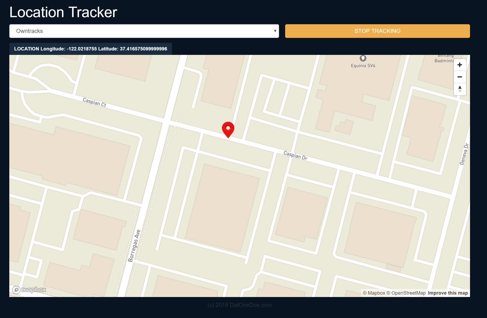

## PROBLEM STATEMENT
The Problem Statement is to publish Location data from your smartphone (assuming, your smartphone is the autonomous vehicle), receive that in a web service and visualize the location on a map within a web app.

- For the smartphone side: Owntracks is used to publish the phone GPS location (https://itunes.apple.com/us/app/owntracks/id692424691?mt=8) (https://play.google.com/store/apps/details?id=org.owntracks.android)
- For communication: a free cloud MQTT Broker using CloudMQTT (https://www.cloudmqtt.com/)
- For the web service: NodeJS/Express
- For the web app: React.js
- For mapping: Mapbox

## SUGGESTED SOLUTIONS AND DEMOS
DEMO with OwnTracks

### EXTRA:
- Autonomous simulation added to the problem.
  - Given a GPS location of a device (ex: car), display that location on the map then make that device change its locations in such away that it mimics a vehicle moving on street.
  
DEMO with autonomous simulation:

